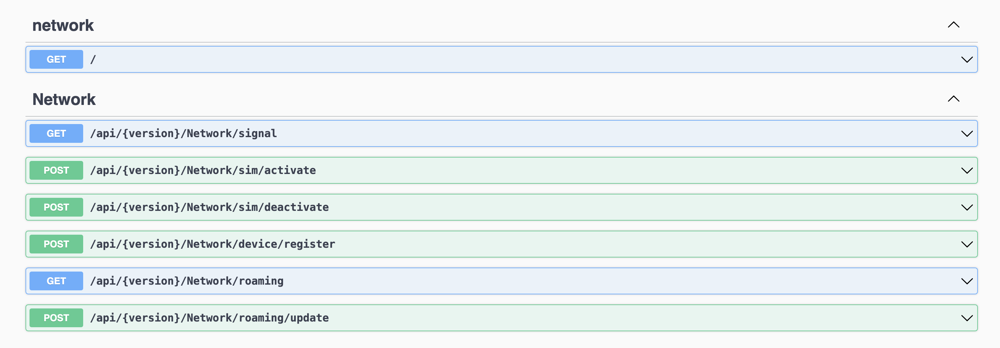

# Run the API

We've stated already that the code is divided in three funcional domains. Each domain has it's own .NET WebAPI project in a separate directory, with a Dockerfile for creating the corresponding container image. This way you can run in any environment as standalone containers or with orchestration tools.

The APIs come with "seeded" dummy data to be ready to use.

- Accounts and their usage, for IDs 100 to 199
- Partners and their agreements, for IDs 100 to 199
- SIMs with ID 100 to 199, in format `SIMXXX`, including their roaming status
- Signal for any location passed as `string`

Feel free to fork the repository and add your own database if required.

## Deployment

Using Akamai Cloud, you can easily deploy the APIs on LKE by using AppPlatform. Using this path allows you to have a private image repository with Harbor and run the APIs as Knative Services, without requiring to provide other infrastructure than a your Kubernetes Cluster.

> Read more about the process in the [AppPlatform documentation](https://apl-docs.net/docs/akamai-app-platform/introduction). [Here's a repository](https://github.com/jgaonakm/apl-sample-workloads) with additional examples, in case you want to keep exploring the tool. If needed, you can [create a Linode account](https://login.linode.com/signup?promo=docs05012025) to try this guide with a $100 credit.

If you prefer other options, there are multiple paths you can follow:

- Run all the APIs from the source code using `dotnet run`
- Generate local images and run them
- Create a Docker compose file
- Docker Swarm
- Kubernetes Cluster
- ...

In any case, the end goal is having the three APIs running and accessible through the internet, so they receive traffic from our Zuplo project.

## OAS

You can access the Open API Specification file, commonly known as swagger file, using the URL of each API and adding /swagger at the end

`https://[API URL]/swagger`

You will use the specification files for the three APIs for the Zuplo configuration prepared for this guide.

**Next >** [Create Zuplo configuration](zuplo.md).
