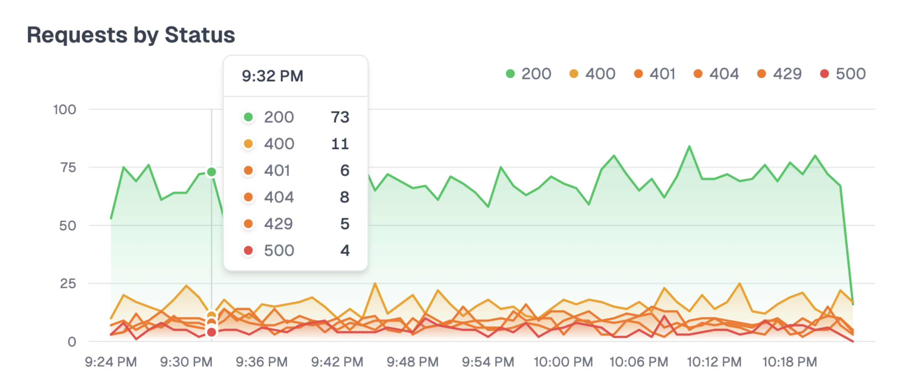
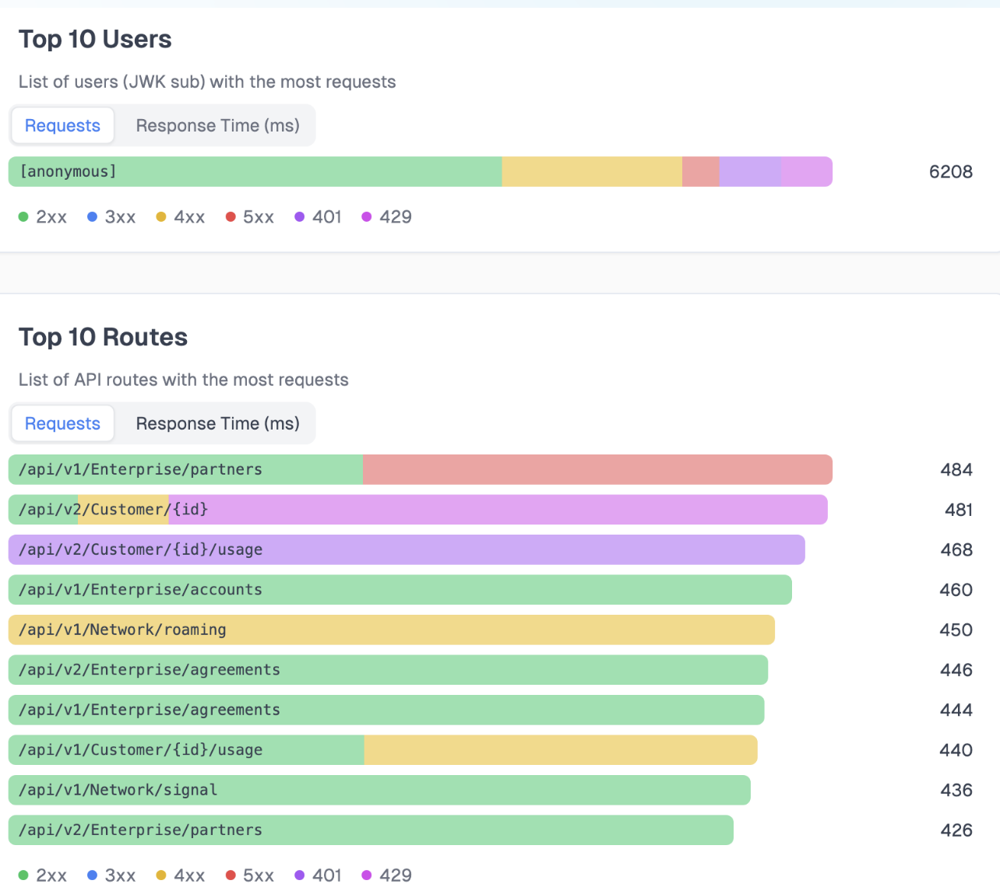

# Traffic Generation

To make it easier to test Zuplo capabilities like logs and analytics, you can use the traffic generation console app.






Once you've completed the Zuplo configuration, run the application (using `dotnet run` or as a container) providing the base url deployment as an environment variable.

```sh
export API_BASE_URL="https://[Gateway URL]/api/"
```

The code runs an infinite loop, with 500ms pauses between iterations. On each, it selects randomly one of the endpoints from the list and makes a call, printing the response to the console. The traffic generated is reflected on the Zuplo console and externally if sending logs elsewhere.
