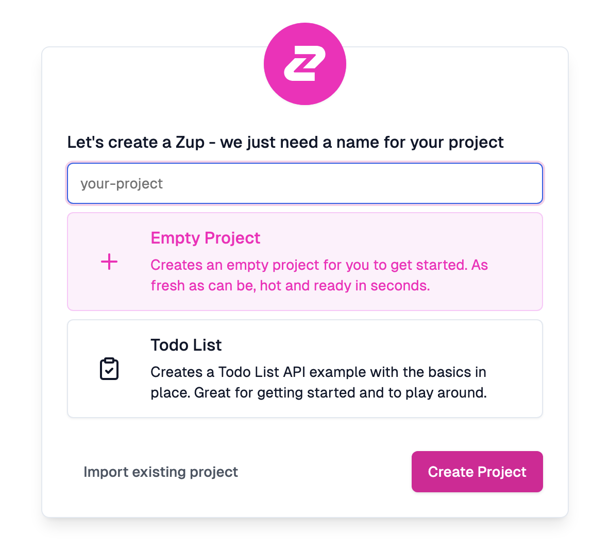
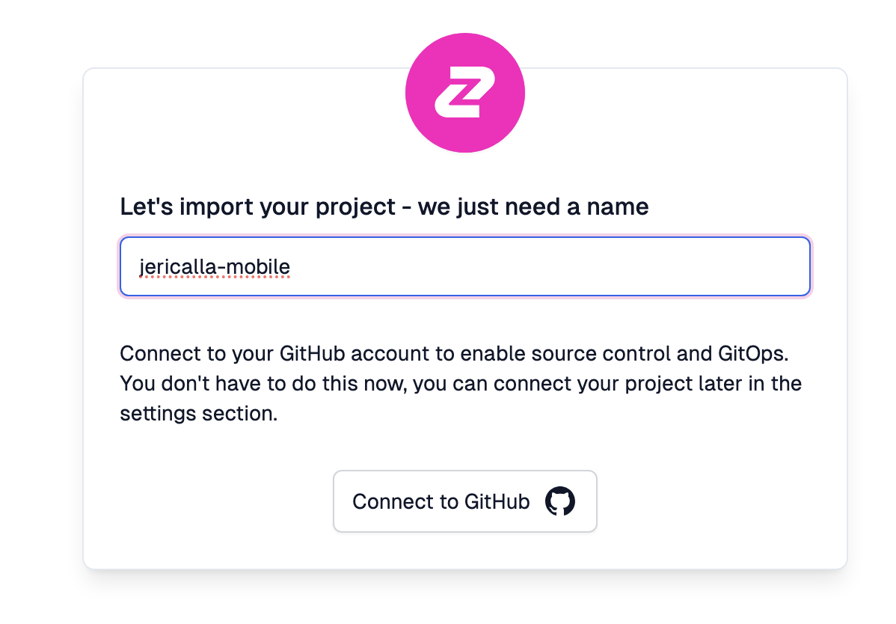
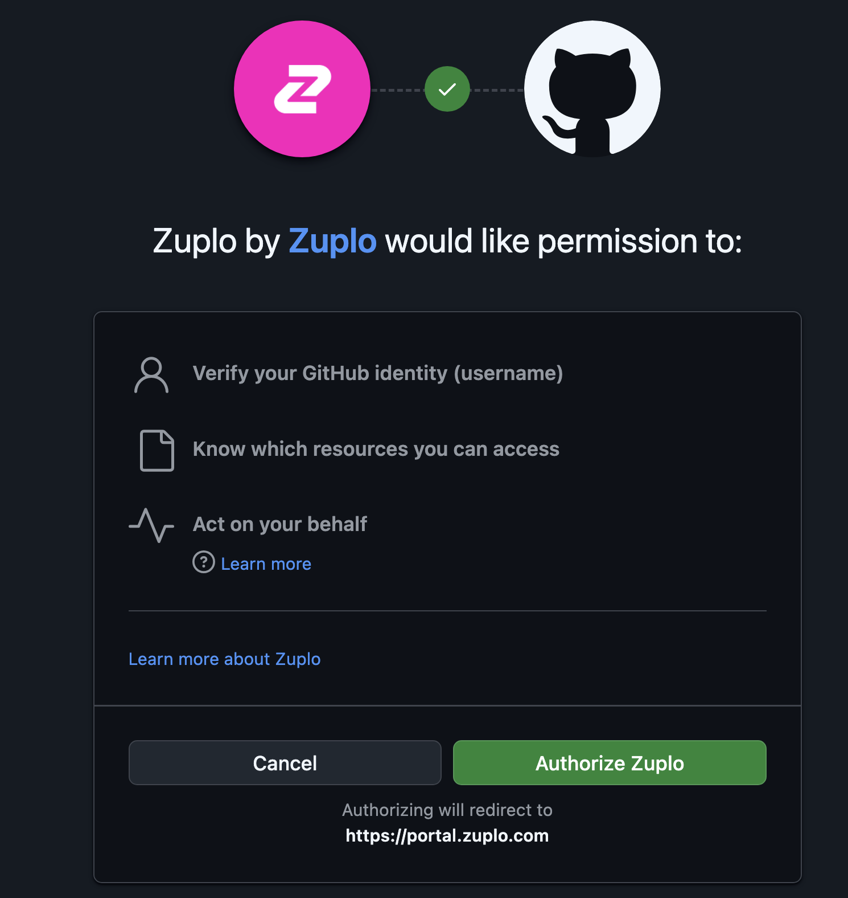
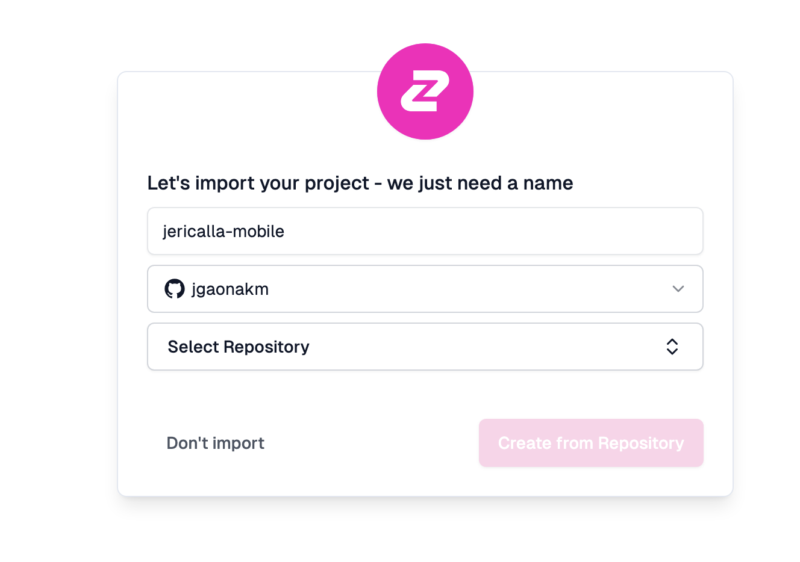
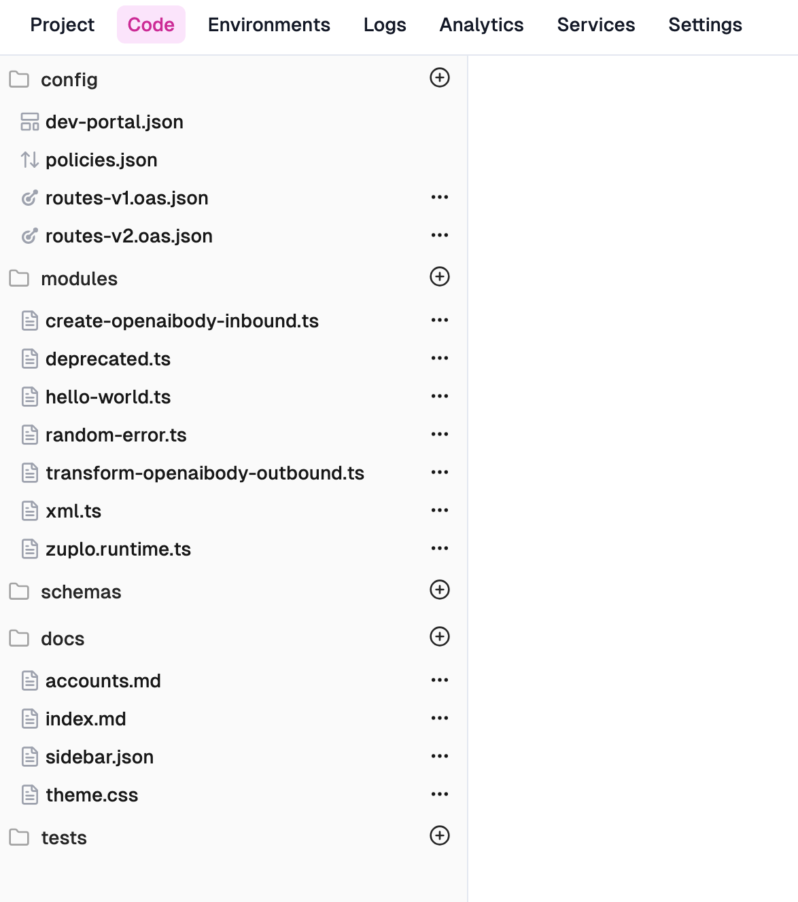
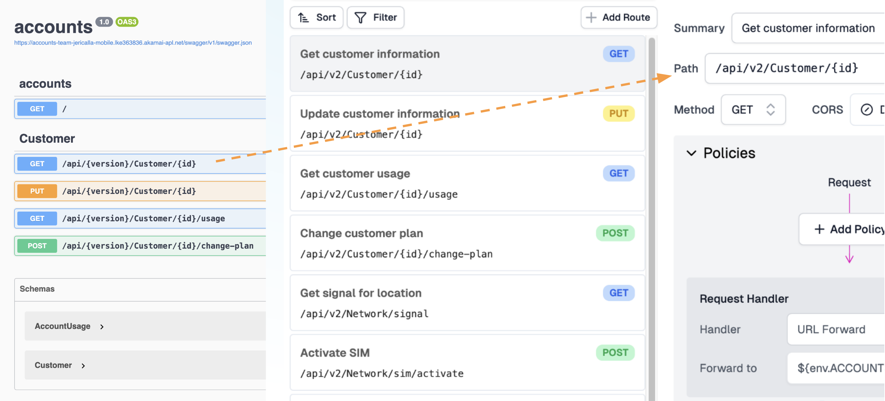
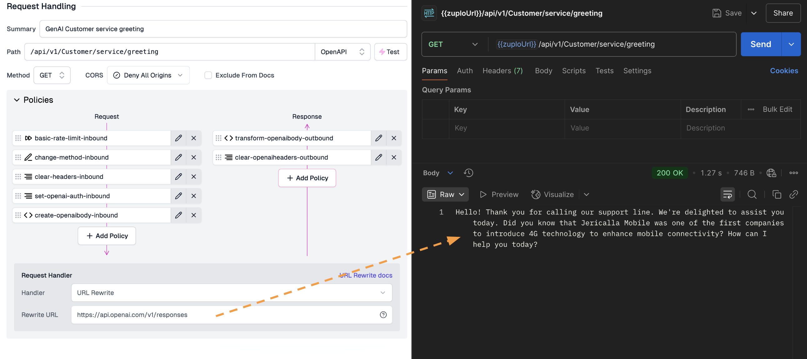

# Create Zuplo configuration

To follow the steps described on this section, **[fork the corresponding repository](https://github.com/jgaonakm/jericalla-mobile-api-mgr)**.

## API definition

This Zuplo API was created within the portal. Thanks to their GitOps-friendly workflows, all the definitions can be stored as code using repositories like this one. To get started with this section, sign in to [portal.zuplo.com](portal.zuplo.com) and create a free account.

> To learn more about Zuplo, you can visit the [Zuplo documentation](https://zuplo.com/docs).

Click on "New project", and on the window that appears, click on "Import existing project"

Use the name provided or specify a custom one

and connect Zuplo to your Github account.

Select the repository you forked, and click on "Create from repository"

The process finishes in a few seconds. Click on the "Code" tab, and you should be able to see all the configuration included in the repository.

## Code

The project comes with the following configuration

- API routes for `v1` (marked as deprecated) and `v2`. All routes are configured to point to the same backend URL.
- Multiple input and output policies, some of them already applied to routes.
- Modules for custom-code policies and routes that use functions (i.e. not pointing to a backend).
- Runtime configuration, with code for sending the logs to Loki.

## Environment variables

This guide relies on variables to define the location of the backend APIs, [defined on the first part](https://github.com/jgaonakm/jericalla-mobile-api). Since Zuplo offers unlimited preview environments, you can emulate having different backends for your production, QA, and develop instances. [Create the following environment variables](https://zuplo.com/docs/articles/environment-variables) for your project:

- ACCOUNTS_URL: The URL the Accounts API running on LKE (or your preferred location)
- ENTERPRISE_URL: Same, for the Enterprise API
- NETWORK_URL: Same, for the Network API

Some (optional) examples present on this guide require additional variables:

- Loki Configuration: For external log storage and visualization
  - LOKI_URL
  - LOKI_USR
  - LOKI_PWD

- OpenAI API Key: To test the GenAI / extenal API example
  - OPEN_AI

**Next >** [Traffic generation](zuplo.md)
