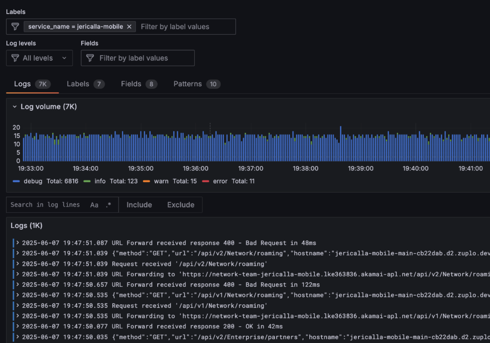

# Create Zuplo configuration

To follow the steps described on this section, **[fork the corresponding repository](https://github.com/jgaonakm/jericalla-mobile-api-mgr)**.

## API definition

This Zuplo API was created within the portal. Thanks to their GitOps-friendly workflows, all the definitions can be stored as code using repositories like this one. To get started with this section, sign in to [portal.zuplo.com](portal.zuplo.com) and create a free account.

> To learn more about Zuplo, you can visit the [Zuplo documentation](https://zuplo.com/docs).

Click on "New project", and on the window that appears, click on "Import existing project"

Use the name provided or specify a custom one

and connect Zuplo to your Github account.

Select the repository you forked, and click on "Create from repository"

The process finishes in a few seconds. Click on the "Code" tab, and you should be able to see all the configuration included in the repository.

## Code

The project comes with the following configuration

- API routes for `v1` (marked as deprecated) and `v2`. All routes are configured to point to the same backend URL.
- Modules for custom-code policies and routes that use functions (i.e. not pointing to a backend).
- Runtime configuration, with code for sending the logs to Loki.

Talking about the policies, the example includues the following examples (both input and output), some of them already applied to routes:

- Inbound:
  - Sleep: Delay the request for one second
  - Monetization: Block request from non-paying users. Requires monetization configuration.
  - Api Key: Block unauthorized requests.
  - Basic Rate Limit: Establish a limit of two requests each second for each IP.
  - Set accept-xml: Sets the `accept-xml` header for the backend API, wich in turn will respond with XML instead of JSON.
  - Geo filter: Blocks requests from clients that aren't present on the defined list.
  - Random error: Randomly return an error (HTTP 500). Currently set at 50% probability.
  - Change method: Changes the HTTP verb to be used for the backend API.
  - Set OpenAI auth & Create OpenAI body: Used for calling OpenAI as the backend API for the GenAI example.
  - Clear headers: Delete all the headers sent from the client

- Outbound:
  - Replace `null`: Replaces the `null` values from the body with a `-1`.
  - XML to JSON (basic): Transforms the XML response to JSON format as is.
  - XML to JSON (advanced): Creates a JSON structure different than what's received as XML.
  - Clear OpenAI headers & transform OpenAI body: Used on the GenAI example to abstract away details.

## Environment variables

This guide relies on variables to define the location of the backend APIs, [defined on the first part](https://github.com/jgaonakm/jericalla-mobile-api). Since Zuplo offers unlimited preview environments, you can emulate having different backends for your production, QA, and develop instances. [Create the following environment variables](https://zuplo.com/docs/articles/environment-variables) for your project:

- ACCOUNTS_URL: The URL the Accounts API running on LKE (or your preferred location)
- ENTERPRISE_URL: Same, for the Enterprise API
- NETWORK_URL: Same, for the Network API

Some (optional) examples present on this guide require additional variables:

- Loki Configuration: For external log storage and visualization
  - LOKI_URL
  - LOKI_USR
  - LOKI_PWD

- OpenAI API Key: To test the GenAI / extenal API example
  - OPEN_AI

**Next >** [Traffic generation](zuplo.md)
